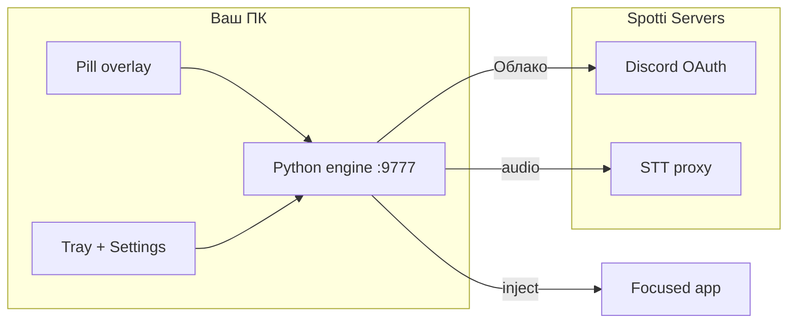

<div align="center">

# Spotti Voice

**Push-to-talk speech-to-text for Windows.** Floating pill, system tray, inject into any focused field.

[](https://github.com/voidmute/Spotti-Voice/actions/workflows/ci.yml)
[](LICENSE)
[](https://github.com/voidmute/Spotti-Voice/releases)
[](https://spottibot.duckdns.org)

[Скачать релиз](https://github.com/voidmute/Spotti-Voice/releases) · [Безопасность](SECURITY.md) · [Contributing](CONTRIBUTING.md)

</div>

---

## Зачем

Говоришь — текст попадает в Discord, браузер, IDE, куда угодно, пока курсор в поле ввода. Два режима:

| Режим | Сеть | Языки |
|-------|------|--------|
| **Локально** | Офлайн после загрузки модели (~142 MB) | Русский (`whisper.cpp`) |
| **Облако** | TLS на Spotti Servers | Много; вход через Discord |

В облаке **не нужен** OpenAI-ключ на ПК. Токены — Windows DPAPI.



## Установка (пользователи)

1. Скачайте **`SpottiVoice-Setup.exe`** из [Releases](https://github.com/voidmute/Spotti-Voice/releases).
2. Запустите установщик (Python/Node не нужны).
3. Откройте **Spotti Voice** из меню Пуск.
4. **Облако:** Настройки → Облако → **Войти через Discord**.
5. **Локально:** Настройки → Локально → при первом запуске скачается модель.

Горячая клавиша по умолчанию: **Ctrl+Shift+Space** (toggle PTT). Меню в трее → **Setup**.

## Сборка из исходников

**Требования:** Windows 10+, Python 3.11+, Node 20+, NSIS 3.x (для установщика).

```bat
cd voice-pill
build-exe.bat
build-setup.bat
```

Артефакт: `voice-pill\dist-setup\SpottiVoice-Setup.exe`

Разработка без установщика:

```bat
cd voice-pill
run.bat
```

Подробнее: [voice-pill/README.md](voice-pill/README.md) (в монорепо Spotti) · [RELEASE.md](voice-pill/RELEASE.md)

## Окружение (только разработка)

Скопируйте `.env.example` → `voice-pill/.env`. Ключ `SPOTTI_VOICE_API_BASE` — если тестируете staging API. **Не коммитьте `.env`.**

## Безопасность

- Движок слушает только `127.0.0.1:9777`.
- Electron: `contextIsolation: true`, узкий preload-мост.
- OAuth: `spotti-voice://auth/callback` (регистрирует установщик); в dev Electron — `http://127.0.0.1:9780/auth/callback`.

Полный текст: [SECURITY.md](SECURITY.md)

## CI

На каждый push/PR в `main`: secret scan, `pytest tests/voice_pill/`, сборка web UI. См. [`.github/workflows/ci.yml`](.github/workflows/ci.yml).

## Связь с Spotti

Публичный клиент + этот репозиторий. Сервер OAuth/STT — приватный монорепо [Spotti](https://github.com/voidmute/Spotti) (`spotti/api/routes/voice_app.py`). Экспорт из монорепо: `scripts/migrate/export-voice-public.ps1`.

## Лицензия

[MIT](LICENSE)
