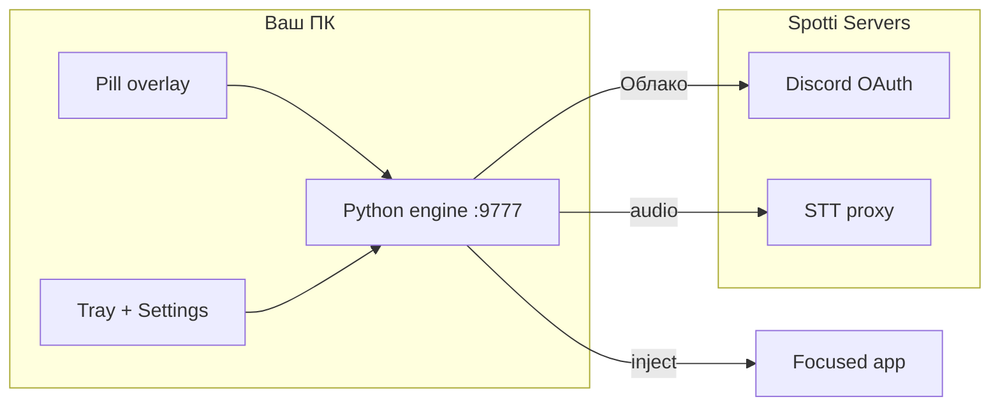
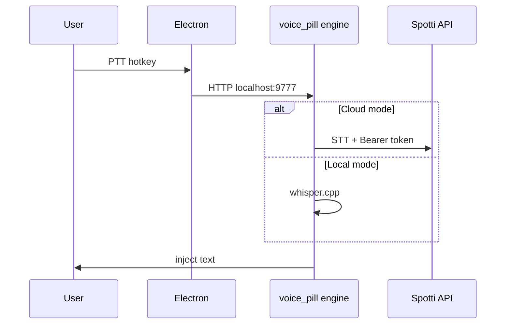

<div align="center">
    
    <h1>Spotti Voice</h1>
    <p>
        <strong>Говори — текст в любом окне</strong><br/>
        Push-to-talk для Windows
    </p>
    <sub>При первом запуске Спотти проведёт короткое обучение на русском</sub>
</div>

<div align="center">
    <a href="https://github.com/voidmute/Spotti-Voice/releases/latest"></a>
    <a href="https://github.com/voidmute/Spotti-Voice/releases/tag/v0.1.0.21"></a>
    <a href="CHANGELOG.md"></a>
    <br/>
    <a href="https://github.com/voidmute/Spotti-Voice/actions/workflows/ci.yml"></a>
    <a href="LICENSE"></a>
    <a href="SECURITY.md"></a>
    <a href="CONTRIBUTING.md"></a>
    <br/>
    <a href="https://spottibot.duckdns.org"></a>
</div>

---

## 🎙️ Что это

**Spotti Voice** — десктопный голосовой ввод для Windows. Зажми горячую клавишу, говори — распознанный текст вставляется в активное поле (Discord, браузер, IDE, блокнот).

| | |
|---|---|
| **Overlay** | Капсула над треем — статус записи |
| **Tray** | Быстрый доступ к настройкам и выходу |
| **Onboarding** | Один раз при первом старте — RPG-чат с пиксельным Спотти |
| **Установщик** | Один файл `SpottiVoice-Setup.exe` (~0.5 MB), остальное с сервера |

```javascript
const SpottiVoice = {
    platform: "Windows 10+",
    hotkey: { default: "Ctrl + Shift + Пробел", mode: "toggle PTT" },
    modes: {
        local: { network: "offline", language: "русский", engine: "whisper.cpp" },
        cloud: { network: "TLS", auth: "Discord OAuth", stt: "Spotti Servers" },
    },
    stack: {
        shell: ["Electron", "React", "anime.js"],
        engine: ["Python", "FastAPI", "sounddevice"],
        installer: ["NSIS thin bootstrap", "Electron setup wizard"],
    },
    security: {
        engineBind: "127.0.0.1:9777",
        electron: "contextIsolation + narrow preload",
        tokens: "Windows DPAPI",
    },
};
```

## ⚡ Режимы

| Режим | Сеть | Языки | Вход |
|-------|------|--------|------|
| **Локально** | Офлайн после модели (~142 MB) | Русский | Не нужен |
| **Облако** | TLS на Spotti Servers | Много (auto) | Discord |



---

## 📥 Установка

<details open>
<summary><h3>🚀 Быстрый старт (пользователи)</h3></summary>

1. Скачайте **`SpottiVoice-Setup.exe`** из [Releases](https://github.com/voidmute/Spotti-Voice/releases/latest).
2. Запустите установщик — мастер скачает приложение с сервера.
3. При **первом запуске** откроются настройки и обучение со Спотти (один раз).
4. **Облако:** переключатель вверху → **Аккаунт** → **Войти через Discord**.
5. **Локально:** при первом PTT скачается модель whisper.

| Шаг | Действие |
|-----|----------|
| Запись | **Ctrl+Shift+Пробел** (по умолчанию) — toggle PTT |
| Настройки | Иконка в трее → **Setup** |
| Горячая клавиша | Настройки → **Горячая клавиша** |

[](https://github.com/voidmute/Spotti-Voice/releases/download/v0.1.0.21/SpottiVoice-Setup.exe)

</details>

<details>
<summary><h3>🛠 Сборка из исходников</h3></summary>

**Требования:** Windows 10+, Python 3.11+, Node 20+, NSIS 3.x.

```bat
cd voice-pill
build-exe.bat
build-setup.bat
```

| Скрипт | Результат |
|--------|-----------|
| `build-exe.bat` | Portable payload в `dist/` |
| `build-setup.bat` | `dist-setup/SpottiVoice-Setup.exe` |

Разработка без установщика:

```bat
cd voice-pill
run.bat
```

Подробнее: [voice-pill/README.md](voice-pill/README.md) · [voice-pill/RELEASE.md](voice-pill/RELEASE.md)

</details>

<details>
<summary><h3>🔐 Безопасность</h3></summary>

- Движок слушает только **`127.0.0.1:9777`**
- Electron: **`contextIsolation: true`**, узкий preload-мост
- OAuth: `spotti-voice://auth/callback` (регистрирует установщик)

> [!CAUTION]
> Не коммитьте `.env`. См. [SECURITY.md](SECURITY.md)

</details>

<details>
<summary><h3>🧪 CI и тесты</h3></summary>

На каждый push/PR в `main`:

- Secret scan
- `pytest tests/voice_pill/`
- Сборка web UI

См. [`.github/workflows/ci.yml`](.github/workflows/ci.yml)

```powershell
pytest tests/voice_pill/ -q
```

</details>

---

## 🏗 Архитектура



## 🔗 Связь с Spotti

| Репозиторий | Роль |
|-------------|------|
| **[Spotti-Voice](https://github.com/voidmute/Spotti-Voice)** (этот) | Публичный клиент + установщик |
| **[Spotti](https://github.com/voidmute/Spotti)** (приватный) | Сервер OAuth/STT, монорепо |

Экспорт из монорепо:

```powershell
.\scripts\migrate\export-voice-public.ps1 -OutDir ..\Spotti-Voice
```

---

<div align="center">

### 📊 Репозиторий

[](https://github.com/voidmute/Spotti-Voice)

[](https://github.com/voidmute/Spotti-Voice/stargazers)
[](https://github.com/voidmute/Spotti-Voice/network/members)
[](https://github.com/voidmute/Spotti-Voice/releases)

<br/>

**[Скачать v0.1.0.21](https://github.com/voidmute/Spotti-Voice/releases/tag/v0.1.0.21)** · [Changelog](CHANGELOG.md) · [Issues](https://github.com/voidmute/Spotti-Voice/issues)

<br/>

[MIT](LICENSE) · Spotti Voice © [voidmute](https://github.com/voidmute)

</div>
