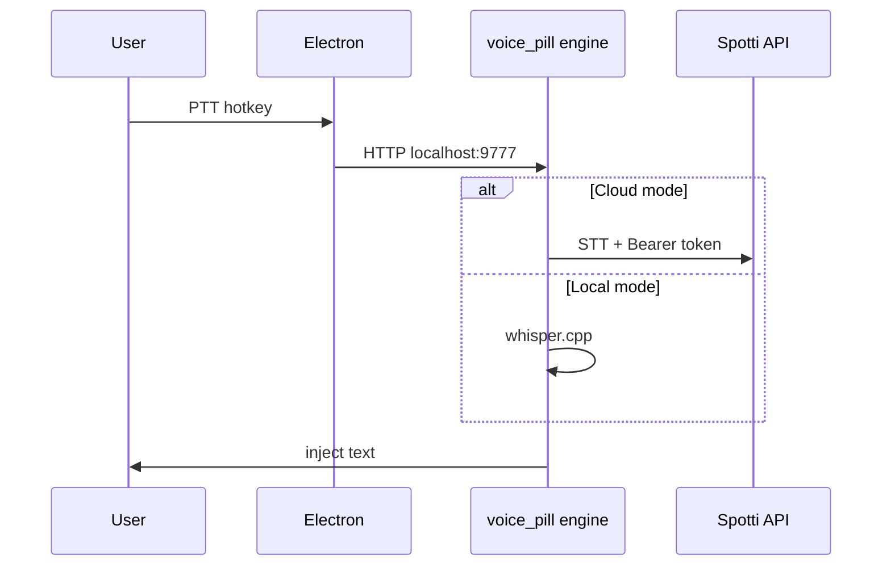

<div align="center">

# Spotti Voice

**Windows desktop STT overlay** — monorepo developer docs. Public releases: [Spotti-Voice](https://github.com/voidmute/Spotti-Voice).

[](https://github.com/voidmute/Spotti/actions/workflows/ci.yml)

</div>

---

## Overview

| Piece | Path |
|-------|------|
| Electron shell + tray | `electron/` |
| Settings + pill UI | `web/` |
| STT / PTT / inject engine | `../voice_pill/engine/` |
| Installer (NSIS + setup wizard) | `installer/` |
| Tests | `../tests/voice_pill/` |

**Modes:** local Russian (`whisper.cpp`) or **cloud** (Spotti Servers + Discord sign-in, no user OpenAI key).

## Requirements

- Windows 10/11
- Python 3.11+ (repo venv)
- Node.js 20+
- Microphone
- **Cloud:** Spotti Discord account; optional dev `SPOTTI_VOICE_API_BASE` in `voice-pill/.env` (see export template `env.example`)

## Quick start (dev)

```powershell
cd voice-pill
.\run.bat
```

`run.bat` builds web UI if needed, starts Electron, Electron spawns the engine (single STT process).

Quit from tray (**Quit**) before restart — stale `electron.exe` causes cache lock / PTT conflicts.

## Build

| Script | Output |
|--------|--------|
| `build-engine.bat` | Branded `dist/Spotti Voice.exe` + engine exe |
| `build-exe.bat` | Full portable payload |
| `build-setup.bat` | `dist-setup/SpottiVoice-Setup.exe` (single-file NSIS) |

Release checklist: [RELEASE.md](RELEASE.md)

## Install (end users)

1. Download **`SpottiVoice-Setup.exe`** from [Releases](https://github.com/voidmute/Spotti-Voice/releases).
2. Run it — wizard installs Spotti Voice (no zip, no extra files).

Export to public repo:

```powershell
..\scripts\migrate\export-voice-public.ps1 -OutDir ..\Spotti-Voice
```

## Use

1. Focus any text field.
2. **Ctrl+Shift+Space** — start/stop listen → inject transcript.
3. Tray → **Setup** — mode, language, injection, cloud sign-in.
4. **Test inject** — writes `Spotti Voice test ` into focused field.

Windows overlay uses `setShape` (HRGN) by default; set `USE_OVERLAY_SET_SHAPE=false` if you prefer CSS radius over corner bleed.

## Cloud auth (Electron)

Local OAuth callback server on `http://127.0.0.1:9780/auth/callback` when `SPOTTI_VOICE_ELECTRON=1`. Register that URI in Discord Developer Portal for dev builds.

## Tests

```powershell
pytest tests/voice_pill/ -q
```

CI (monorepo): [`.github/workflows/ci.yml`](../.github/workflows/ci.yml) — same tests on Ubuntu; DPAPI test skips on non-Windows.

## Local Whisper files

Default install path: `%APPDATA%\SpottiVoice\whisper\` (`whisper-cli.exe`, `ggml-base.bin`). Manual fetch:

```powershell
powershell -NoProfile -ExecutionPolicy Bypass -File .\scripts\fetch-whisper.ps1
```

## Architecture



## See also

- [Spotti monorepo README](../README.md) — VPS `voice_app` routes
- [Spotti-Voice public README](https://github.com/voidmute/Spotti-Voice/blob/main/README.md)
